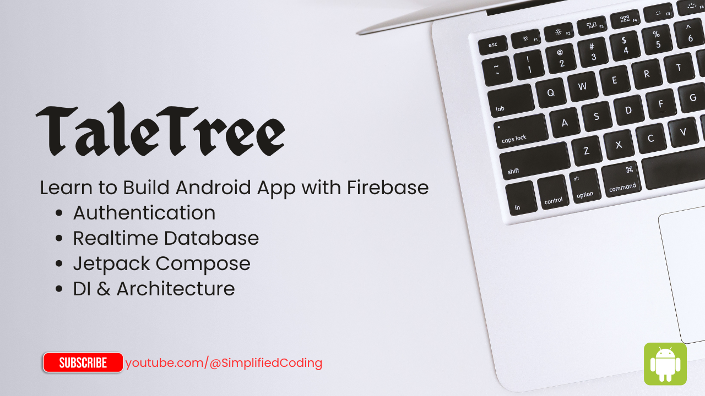

# TaleTree 📚

## Overview

TaleTree is a hands-on Android tutorial project designed to teach modern Firebase integration using real-world features. Through this project, you'll learn how to implement Firebase Authentication and Firestore Database within a clean architecture setup using Jetpack Compose. It's a practical learning resource for Android developers looking to build scalable and production-ready apps with Firebase.

## What You'll Learn

Through this hands-on tutorial series, you'll gain practical experience with:

- **Firebase Authentication** - Secure user registration and login flows
- **Firestore Database** - Real-time data storage and retrieval for stories
- **MVVM Architecture** - Clean, maintainable code structure
- **Jetpack Compose** - Modern Android UI toolkit
- **Dependency Injection with Hilt** - Efficient dependency management
- **Kotlin Best Practices** - Writing clean, idiomatic Kotlin code

## Project Structure

```
TaleTree/
├── codebase/
│   └── starter-project/     # Your starting point for the tutorial
├── app/                     # Complete implementation
└── README.md
```

## Features

### 🔐 User Authentication

- Secure email/password registration
- Smooth login and logout functionality
- User profile management
- Password recovery options

### 📖 Story Management

- Create and publish short stories
- Browse stories from other writers
- Real-time story updates
- Story categorization and tagging

### 🎨 Modern UI/UX

- Beautiful Material Design 3 interface
- Smooth animations and transitions
- Responsive layouts for all screen sizes
- Dark mode support

## Technology Stack

- **Language**: Kotlin
- **UI Framework**: Jetpack Compose
- **Architecture**: MVVM (Model-View-ViewModel)
- **Dependency Injection**: Hilt
- **Backend**: Firebase (Authentication + Firestore)
- **Build System**: Gradle with Kotlin DSL

## Getting Started

### Prerequisites

Before you begin, ensure you have:

- Android Studio Arctic Fox or later
- JDK 11 or higher
- Android SDK 24+
- Firebase project setup (we'll cover this in the tutorial)

### Quick Setup

1. **Clone the repository**
   ```bash
   git clone https://github.com/yourusername/TaleTree.git
   cd TaleTree
   ```

2. **Navigate to the starter project**
   ```bash
   cd codebase/starter-project
   ```

3. **Open in Android Studio**
    - Launch Android Studio
    - Select "Open an existing project"
    - Navigate to the `codebase/starter-project` folder

4. **Follow the tutorial**
    - Start with the documentation in the `/docs` folder
    - Each tutorial step builds upon the previous one
    - The complete implementation is available in the main `/app` directory

## Tutorial Journey

This learning experience is structured as a step-by-step journey:

1. **Project Setup** - Setting up the development environment
2. **Firebase Configuration** - Connecting your app to Firebase
3. **Authentication Implementation** - Building secure login flows
4. **Database Design** - Structuring your Firestore data
5. **Story Creation** - Implementing the story publishing feature
6. **Story Reading** - Building the story browsing experience
7. **User Profiles** - Adding personalization features
8. **Testing & Debugging** - Ensuring your app works flawlessly

## Architecture Highlights

TaleTree follows the MVVM architectural pattern, promoting:

- **Separation of Concerns** - Each component has a single responsibility
- **Testability** - Easy unit testing with mocked dependencies
- **Maintainability** - Clean code that's easy to modify and extend
- **Scalability** - Architecture that grows with your app's needs

## Contributing

We welcome contributions from the community! Whether you want to:

- Fix bugs or improve existing features
- Add new tutorial content
- Enhance documentation
- Suggest improvements

Please feel free to open issues or submit pull requests. Make sure to follow our coding standards
and include appropriate tests.

## Support

Having trouble with the tutorial or found a bug? Here's how to get help:

- Check the [Issues](https://github.com/probelalkhan/TaleTree/issues) page for similar problems
- Create a new issue with detailed information about your problem
- Join our community discussions for general questions

## License

This project is licensed under the MIT License.

## Acknowledgments

- Firebase team for excellent documentation and tools
- Android development community for inspiration and support
- All contributors who help improve this learning resource

---

**Happy Coding! 🚀**

*Remember, every expert was once a beginner. Take your time, practice regularly, and don't hesitate
to experiment with the code. The best way to learn is by building something you're passionate
about.*